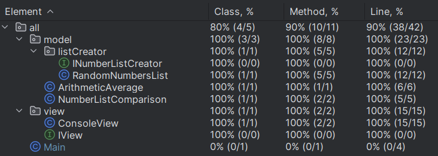
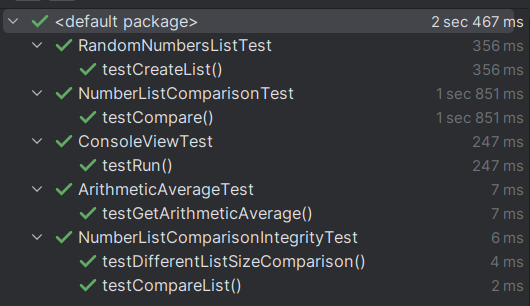

# Проект для демонстрации навыков в написании тестов

## Программа
Для тестирования была написана программа удовлетворяющая следующим требованиям:

Программа должна принимать два списка чисел и выполнять следующие действия:
1. Рассчитывает среднее значение каждого списка.
2. Сравнивает эти средние значения и выводит соответствующее сообщение:
    - "Первый список имеет большее среднее значение", если среднее значение первого списка больше.
    - "Второй список имеет большее среднее значение", если среднее значение второго списка больше.
    - "Средние значения равны", если средние значения списков равны.

## Тесты
Дла проверки работоспособности программы были написаны 6 тестов.
### unit тесты
- testCreateList в классе RandomNumbersListTest
- testGetArithmeticAverage в классе ArithmeticAverageTest
- testCompare в классе NumberListComparisonTest
- testRun в классе ConsoleViewTest
### интеграционные тесты
- testDifferentListSizeComparison в классе NumberListComparisonIntegrityTest
- testCompareList в классе NumberListComparisonIntegrityTest
### сквозные тесты
Т.к. программа не принимает от пользователя никаких команд, написание сквозного теста является избыточным,
он бы повторил действия интеграционных тестов и unit теста view.
## Метрики

### Отчет о покрытии кода тестами

### Пояснения по покрытию тестами
- unit тест testCreateList создаёт экземпляр класса генерирующего список,
вызывает метод генерации списка, и проверяет соответсвует ли длинна сгенерированного списка,
параметру длинны переданному в конструкторе.
- unit тест testGetArithmeticAverage создаёт экземпляр класса вычисляющего среднее арифметическое,
создаёт список чисел, и передаёт этот список в метод для вычислений,
затем проверяет соответсвие вычислений, заданному значению.
- unit тест testCompare создаёт экземпляр класса для сравнения списков, использую mock объект для изоляции,
так же создёт два списка, проводит вызов метода сравнения и проверяет результат на соответствие проверочному значению.
- unit тест testRun создаёт экземпляр класса, используя mock объекты для изоляции, модулирует поведение объектов для выполнения различных сценариев,
проверяет соответсвие вывода, по каждому сценарию, с проверочным текстом.
- интеграционный тест testDifferentListSizeComparison, проверяет логику взаимодействия классов,
используя методы и экземпляры боевых классов, в случае если мы сравниваем списки разной длинны.
- интеграционный тест testCompareList, проверяет логику взаимодействия классов, используя методы и экземпляры боевых классов,
проверяет правильность работы логики сравнения.